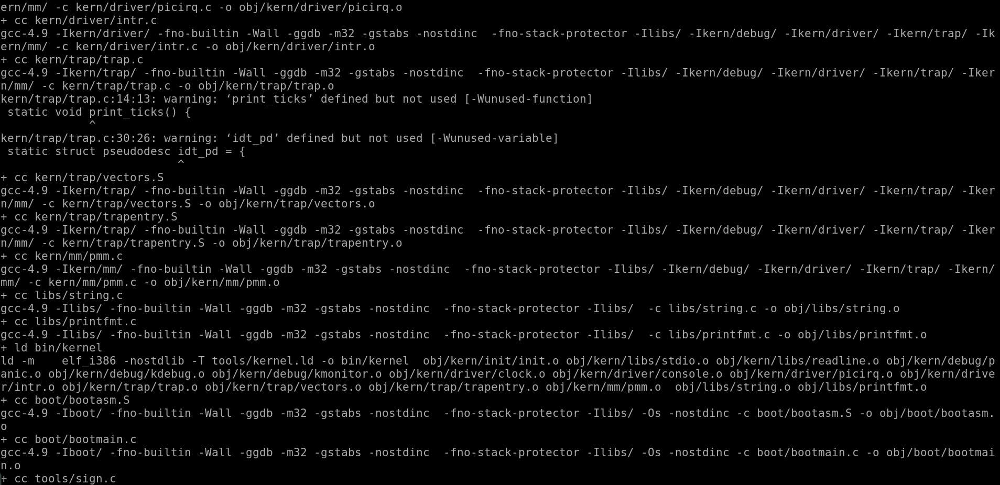

# 实验前的准备

## 观察makefile的结构：  
1～138行：定义各种变量/函数，设置参数，进行准备工作。  
140~153行：生成bin/kernel  
155~170行：生成bin/bootblock  
172~176行：生成bin/sign  
178~188行：生成bin/ucore.img  
189~201行：收尾工作/定义变量  
203~269行：定义各种make目标

## 精细的分析

<code>
V := @
</code>

变量V=@，后面大量使用了V  

@的作用是不输出后面的命令，只输出结果  

在这里修改V即可调整输出的内容  

也可以 make "V=" 来完整输出 

function.mk中定义了大量的函数。
.mk中每个函数都有注释。

<code>
include tools/function.mk
</code>

call函数：call func,变量1，变量2,...

listf函数在function.mk中定义，列出某地址（变量1）下某些类型（变量2）文件

listf_cc函数即列出某地址（变量1）下.c与.S文件

<code>
listf_cc = $(call listf,$(1),$(CTYPE))
</code>

<!--这是lab1_result编译问题的分析和解决过程-->
在用make编译lab1_result时候遇到了一下问题

<code>
...

'obj/bootblock.out' size: 620 bytes  
620 >> 510!!  
Makefile:152: recipe for target 'bin/bootblock' failed
...
</code>
然后make中止，不能继续运行，之后的make grade等操作也同样不能运行

从这两句的输出来看，是可以看出是来源在sign.c文件中定义的st的大小大于510字节导致的  
查看tools/ 目录下的sign.c文件， 可以看到如下代码

    #include <sys/stat.h>

    int
    main(int argc, char *argv[]) {
        struct stat st;
        if (argc != 3) {
            fprintf(stderr, "Usage: <input filename> <output filename>\n");
            return -1;
        }
        if (stat(argv[1], &st) != 0) {
            fprintf(stderr, "Error opening file '%s': %s\n", argv[1], strerror(errno));
            return -1;
        }
        printf("'%s' size: %lld bytes\n", argv[1], (long long)st.st_size);
        if (st.st_size > 510) {
            fprintf(stderr, "%lld >> 510!!\n", (long long)st.st_size);
            return -1;
    }
 
可以看出这里定义了一个结构提变量 st。  
我们转到这个结构体定义的地方  

    struct stat
    {
        __dev_t st_dev;		/* Device.  */
    #ifndef __x86_64__
        unsigned short int __pad1;
    #endif
    #if defined __x86_64__ || !defined __USE_FILE_OFFSET64
        __ino_t st_ino;		/* File serial number.	*/
    #else
        __ino_t __st_ino;			/* 32bit file serial number.	*/
    #endif
    #ifndef __x86_64__
        __mode_t st_mode;			/* File mode.  */
        __nlink_t st_nlink;			/* Link count.  */
    #else
        __nlink_t st_nlink;		/* Link count.  */
        __mode_t st_mode;	
        ......

我们可以看出这里的结构体定义和系统还有gcc版本有关和过程中的环境声明有关，考虑到这个lab1_result的代码在老师给的实验虚拟机上运行是ok的，所以猜测是gcc的版本问题， 我的debian系统上用的是比较新的gcc-6，而实验的环境中的gcc是4.9版本。

故这里尝试使用低版本的gcc

首先， 安装  
在/etc/apt/source.list 文件后面增加  

deb http://ftp.us.debian.org/debian/ jessie main contrib non-free
deb-src http://ftp.us.debian.org/debian/ jessie main contrib non-free

然后运行 sudo apt install gcc-4.9

将lab1工程中的Makefile 中的gcc配置进行修改  

<code>
CC		:= $(GCCPREFIX)gcc-4.9
</code>

再次运行make clean 和 make  
success! 
现在实验环境已经就绪

# 练习1 理解通过make生成执行文件的过程

## 第一题 一个被系统认为是符合规范的硬盘主引导扇区的特征是什么?

## 使用make "V=" 命令的打印结果了解make编译的大致过程
这里使用的是make "V=" 命令，将这里的编译过程全部在终端中展示出来 如图所示  

### 第一步， gcc编译出一系列bin/kernel所需要的目标文件
obj/kern/init/init.o   
obj/kern/init/init.o   
obj/kern/libs/readline.o   
obj/kern/debug/panic.o   
obj/kern/debug/kdebug.o  
obj/kern/debug/kmonitor.o   
obj/kern/driver/clock.o   
obj/kern/driver/console.o   
obj/kern/driver/picirq.o   
obj/kern/driver/intr.o   
obj/kern/trap/trap.o   
obj/kern/trap/vectors.o    
obj/kern/trap/trapentry.o   
obj/kern/mm/pmm.o   
obj/libs/string.o    
obj/libs/printfmt.o   

### 第二步, 生成 bin/kernel
使用ld命令，将这些之前生成的目标文件，链接成可执行文件, 即之后要用到的 bin/kernel

    ld -m    elf_i386 -nostdlib -T tools/kernel.ld -o bin/kernel  obj/kern/init/init.o obj/kern/libs/stdio.o obj/kern/libs/readline.o obj/kern/debug/panic.o obj/kern/debug/kdebug.o obj/kern/debug/kmonitor.o obj/kern/driver/clock.o obj/kern/driver/console.o obj/kern/driver/picirq.o obj/kern/driver/intr.o obj/kern/trap/trap.o obj/kern/trap/vectors.o obj/kern/trap/trapentry.o obj/kern/mm/pmm.o  obj/libs/string.o obj/libs/printfmt.o

### 第三步, 编译出 bin/bootblock 所需要的目标文件
obj/boot/bootasm.o  
obj/boot/bootmain.o   
obj/sign/tools/sign.o   

### 第四步, 将上面的目标文件编译成 bin/bootblock 可执行文件

    ld -m    elf_i386 -nostdlib -N -e start -Ttext 0x7C00 obj/boot/bootasm.o obj/boot/bootmain.o -o obj/bootblock.o

### 第五步, 将第三步中产生的sign.o链接成sign可执行文件

现在一共有bin/kernel, obj/sign/tools/sign, obj/bootblock.out 这三个可执行文件。  

这里这个bootblock.out 的文件大小为468 Bytes  
build 512 bytes boot sector: 'bin/bootblock' success!  
从这句话中可以看出经过一些程序，生成了一个512 Bytes的可执行文件。  
### 第六步, 生成ucore.img 镜像文件    

我们可以看到Makefile文件中有这样一段code  

    UCOREIMG	:= $(call totarget,ucore.img)

    $(UCOREIMG): $(kernel) $(bootblock)
        $(V)dd if=/dev/zero of=$@ count=10000
        $(V)dd if=$(bootblock) of=$@ conv=notrunc
        $(V)dd if=$(kernel) of=$@ seek=1 conv=notrunc

    $(call create_target,ucore.img)

对应make "V=" 的打印结果  

    dd if=/dev/zero of=bin/ucore.img count=10000
    10000+0 records in
    10000+0 records out
    5120000 bytes (5.1 MB, 4.9 MiB) copied, 0.0222739 s, 230 MB/s
    dd if=bin/bootblock of=bin/ucore.img conv=notrunc
    1+0 records in
    1+0 records out
    512 bytes copied, 8.632e-05 s, 5.9 MB/s
    dd if=bin/kernel of=bin/ucore.img seek=1 conv=notrunc
    138+1 records in
    138+1 records out
    70780 bytes (71 kB, 69 KiB) copied, 0.00040367 s, 175 MB/s

linux dd命令用于读取、转换并输出数据。

dd可从标准输入或文件中读取数据，根据指定的格式来转换数据，再输出到文件、设备或标准输出。

if=文件名：输入文件名，缺省为标准输入。即指定源文件。  
of=文件名：输出文件名，缺省为标准输出。即指定目的文件。  
count=blocks：仅拷贝blocks个块，块大小等于ibs指定的字节数。  
conv=notrunc:表示不截短输出文件  

这里的操作就是:  
先用10000block的0来初始化ucore.img, 将bootblock和kernel加入进去, 调用create_target 来生成ucore.img文件. 

## 第二题 一个被系统认为是符合规范的硬盘主引导扇区的特征是什么?

这里我们可以从sign.c这个文件中的看出答案

主引导扇区在磁盘的 0 磁头 0 柱面 1 扇面, 包括硬盘主引导记录MBR(Master Boot Recode) 和分区表DPT(Disk Patition Table). 规范的主引导扇区特征如下:
1. 总大小为512字节, 由启动程序 分区表 和结束符号组成.
2. 最后由一个0x55和一个0xAA表示 启动区的结束字符
3. 由不超过466字节的启动代码和不超过64字节的硬盘分区表加上两个字节的结束符组成

